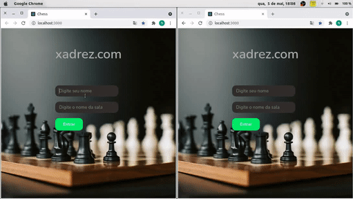

# Chess


## Índice
  1. [Descrição](#description)
  2. [Tecnologias](#techs)
  3. [Como Rodar](#run)
  
 <div id='description' />
 
## Descrição

Projeto desenvolvido com o intuito de aprender um pouco mais sobre Socket.io. Jogadores podem entrar em salas para jogar partidas de xadrez. Regras do xadrez não implementadas.

<div id='techs' />

## Tecnologias

[React](https://pt-br.reactjs.org/)

[Node](https://nodejs.org/en/)

[Express](https://expressjs.com/pt-br/)

[Typescript](https://www.typescriptlang.org/)

[Socket.io](https://socket.io/)

<div id='run' />

## Como rodar

Primeiro clone o projeto:

```bash
> git clone https://github.com/raphaelvaz/chess.git
```
Depois entre na pasta via terminal:

```bash
> cd chess/back
```
Instale todas as dependências:

```bash
> yarn
```

Rode o backend da aplicação:

```bash
> yarn start
```
Abrindo outro terminal:

```bash
> CRTL + ALT + T 
```
Acesse a pasta front via terminal(supondo que foi feito o clone na pasta pessoal):

```bash
> cd chess/front
```
Instale todas as dependências:

```bash
> yarn
```

Rode o front da aplicação:

```bash
> yarn start
```
A aplicação pode ser acessada através de: http://localhost:3000.

